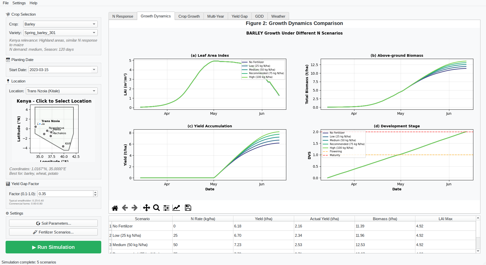

# Kenya Digital Farm Twin - WOFOST Crop Simulator

A PyQt5 desktop application for running WOFOST 8.1 crop simulations with nitrogen and water limitation for various locations in Kenya.


# Screenshot

 


## Features

### Main Configuration
- **Crop Selection**: Choose from 9 crops (barley, wheat, rice, soybean, cowpea, groundnut, potato, cassava, sweetpotato)
- **Variety Selection**: Each crop has pre-configured varieties optimized for WOFOST 8.1
- **Planting Date**: Calendar picker with crop-specific default dates
- **Location Selection**: Interactive map of Kenya with 7 key agricultural locations
- **Yield Gap Factor**: Adjustable ratio (0.1-1.0) comparing actual farmer yields to simulated potential

### Settings Pages
1. **Soil Parameters**
   - Water retention: SM0, SMFCF, SMW, CRAIRC
   - Physical properties: RDMSOL, K0, SOPE, KSUB
   - Nitrogen: NSOILBASE, NSOILBASE_FR
   - Pre-configured soil types: Nitisol, Andosol, Vertisol, Ferralsol, Luvisol

2. **Fertilizer Scenarios**
   - None (0 kg N/ha) - Baseline
   - Low (25 kg N/ha) - Typical smallholder
   - Medium (50 kg N/ha) - Improved smallholder
   - Recommended (75 kg N/ha) - Extension recommendation
   - High (100 kg N/ha) - Commercial/intensive
   - Enable/disable individual scenarios
   - Customizable application timing and recovery fractions

### Interactive Graphs
1. **Figure 1: Nitrogen Response Curve** - Bar chart and response curve showing yield by N rate
2. **Figure 2: Growth Dynamics Comparison** - LAI, biomass, yield accumulation, DVS across scenarios
3. **Figure 3: Detailed Crop Growth** - Four-panel view of selected scenario
4. **Figure 4: Multi-Year Analysis** - Yield variability and biomass comparison
5. **Figure 5: Yield Gap Comparison** - Actual vs potential yield visualization

All graphs include:
- Matplotlib navigation toolbar (zoom, pan, save)
- Interactive tooltips
- High-quality export options

## Installation

### Prerequisites
- Python 3.8 or higher
- pip package manager

### Install Dependencies

```bash
# Create virtual environment (recommended)
python -m venv venv
source venv/bin/activate  # On Windows: venv\Scripts\activate

# Install requirements
pip install -r requirements.txt
```

### PCSE (Python Crop Simulation Environment)
The application requires PCSE 5.5+ with WOFOST 8.1 support:

```bash
pip install pcse
```

Note: PCSE requires internet access on first run to download crop parameters and will cache NASA POWER weather data.

## Usage

### Running the Application

```bash
python main.py
```

### Quick Start
1. Select a crop from the dropdown
2. Choose a location (click on map or use dropdown)
3. Adjust planting date if needed
4. Set yield gap factor for your target farmer type
5. Click "▶ Run Simulation"
6. View results in the graph tabs

### Customizing Soil Parameters
1. Click "🌍 Soil Parameters..." button
2. Select a preset soil type or manually adjust values
3. Click OK to apply

### Customizing Fertilizer Scenarios
1. Click "🧪 Fertilizer Scenarios..." button
2. Enable/disable scenarios using checkboxes
3. Edit application timing and amounts as needed
4. Click OK to apply

## Kenya Locations

| Location | Coordinates | Best Crops |
|----------|-------------|------------|
| Trans Nzoia (Kitale) | 1.02°N, 35.00°E | Barley, Wheat, Potato |
| Narok | 1.08°S, 35.87°E | Wheat, Barley |
| Mwea (Kirinyaga) | 0.73°S, 37.35°E | Rice |
| Busia (Western) | 0.46°N, 34.11°E | Soybean, Groundnut, Cassava |
| Machakos (Eastern) | 1.52°S, 37.26°E | Cowpea |
| Nyandarua (Central) | 0.40°S, 36.50°E | Potato, Wheat |
| Kilifi (Coast) | 3.63°S, 39.85°E | Cassava, Cowpea |

## Kenya Soil Types

| Soil Type | Description | Typical Location |
|-----------|-------------|------------------|
| Nitisol | Highland clay-loam | Trans Nzoia, Eldoret |
| Andosol | Volcanic soil (excellent) | Mt. Kenya, Meru |
| Vertisol | Black cotton clay | Narok |
| Ferralsol | Tropical red (low N) | Western Kenya |
| Luvisol | Semi-arid sandy-loam | Eastern Kenya |

## Model Information

This application uses **WOFOST 8.1** with:
- **Wofost81_NWLP_MLWB_CNB**: Nitrogen and Water Limited Production
- Multi-Layer Water Balance
- Carbon Nitrogen Balance

Weather data is automatically fetched from NASA POWER database.

## File Structure

```
kenya_farm_twin/
├── app
|      └──  main.py           # Main application
├── requirements.txt  # Python runtimedependencies
├── requirements-dev.txt  # Development dependencies
├── requirements-build.txt  # Windows build dependencies
├── requirements-build.txt  # Windows build dependencies
└── README.md        # This file
```


# Windows builds

Take a look at [windows.md](windows.md)

## Troubleshooting

### "No module named 'pcse'"
Install PCSE: `pip install pcse`

### Weather data download fails
Check internet connection. PCSE needs to download NASA POWER data.

### "Crop not available"
Some crops may not be available in WOFOST 8.1. Check PCSE documentation.

### Graphs not displaying
Ensure matplotlib is installed with Qt5 backend: `pip install matplotlib PyQt5`

## License

This application is provided as-is for educational and research purposes.

## References

- PCSE Documentation: https://pcse.readthedocs.io/
- WOFOST Model: https://www.wur.nl/en/Research-Results/Research-Institutes/Environmental-Research/Facilities-Products/Software-and-models/WOFOST.htm
- NASA POWER: https://power.larc.nasa.gov/
